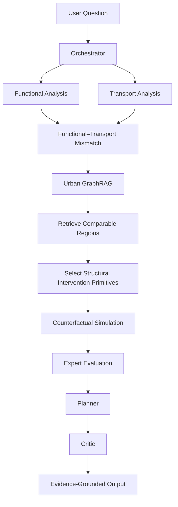

# UrbanGraph Planner

> **Working title:** UrbanGraph Planner  
> **Subtitle:** An Agentic Graph Intelligence Framework for Urban Accessibility, Mobility Diagnosis, and Counterfactual Planning

---

# 1. Project Mission

UrbanGraph Planner is an agentic urban intelligence system designed to:

1. construct a machine-readable urban world model from heterogeneous geospatial, socioeconomic, land-use, mobility, and public-transport data;
2. learn multiple complementary representations of urban regions;
3. identify structural mismatches between urban functions, accessibility, transport provision, and, when available, observed mobility demand;
4. explain these mismatches using structured and traceable evidence;
5. retrieve relevant graph, spatial, vector, transport, mobility, and socioeconomic evidence;
6. generate constrained counterfactual transport-network interventions;
7. simulate how these interventions modify accessibility and graph structure;
8. evaluate intervention scenarios from multiple analytical and stakeholder perspectives;
9. support evidence-grounded urban planning and transport decision support.

The system must NOT be reduced to an LLM chatbot.

The LLM is primarily:

```text
reasoning
+
tool selection
+
workflow orchestration
+
evidence synthesis
```

Numerical analysis must be performed by dedicated spatial, graph, representation, transport, mobility, accessibility, and simulation modules.

---

# 2. Data-Availability-Aware Research Modes

The architecture MUST support different research modes depending on available data.

## 2.1 Current Primary Mode

The currently feasible research mode is:

```text
Urban Functional Structure
        +
Socioeconomic Context
        +
Public Transport Supply
        +
Accessibility
        ↓
Functional–Transport Mismatch
        ↓
Accessibility / Provision Strain
        ↓
Agentic Diagnosis
        ↓
Structural Counterfactual Analysis
```

The current system must NOT claim to observe complete mobility demand when fine-grained OD data are unavailable.

Appropriate terminology includes:

```text
functional–transport mismatch
transport provision gap
accessibility strain
structural under-provision
potential mobility pressure
potential demand
```

Avoid incorrectly calling these:

```text
observed mobility demand
observed mobility strain
actual passenger demand
crowding pressure
```

unless appropriate mobility or ridership observations exist.

---

## 2.2 Optional Coarse Mobility Mode

Public census-based commuting OD data are available from INSEE.

These data can provide:

```text
residence commune
        →
workplace commune
```

with commuting-flow counts.

For Paris, Lyon, and Marseille, the corresponding geography is municipal arrondissement where applicable.

This dataset can support a coarse mobility graph:

```text
Commune / arrondissement
        ↓
commuting OD graph
        ↓
coarse mobility representation
```

However:

- it is census-derived;
- it is primarily home-to-work mobility;
- it is not real-time;
- it is not H3-level observed movement;
- it does not represent all trip purposes;
- weak flows may have higher statistical uncertainty;
- it must not be treated as a replacement for future fine-grained mobility observations.

It may therefore be used as an optional coarse `MobilityView`.

---

## 2.3 Future Full Mobility Mode

When appropriate OD or trajectory-derived mobility data become available, extend the system to:

```text
Functional View
        +
Observed Mobility View
        +
Transport View
        ↓
Cross-view Mobility Strain
```

Future mobility sources may include:

```text
mobile-phone-derived OD
ticketing / smart-card OD
aggregated trajectory OD
pedestrian flows
bike-sharing flows
traffic counts
station entry / exit flows
passenger counts
commercial mobility datasets
```

The architecture MUST reserve interfaces for this future `MobilityView`.

Do NOT tightly couple core modules to the assumption that mobility data are always present.

---

# 3. Core Research Questions

## Current question

> **Can an agentic system reason over urban functional structure, socioeconomic context, accessibility, and public-transport graphs to detect, explain, and counterfactually investigate functional–transport mismatches?**

## Future OD-enabled question

> **Can an agentic system reason over learned multi-view urban representations and heterogeneous urban graphs to diagnose, explain, and mitigate mobility strains?**

---

# 4. Current Scientific Components

The current system contains three primary scientific components.

## A. Urban Functional Representation

Represent each region using observable information such as:

```text
POIs
land use
buildings
road morphology
economic establishments
population
housing
resident activity
services
employment opportunities
```

---

## B. Transport and Accessibility Representation

Represent each region using:

```text
public transport connectivity
GTFS service
stop density
route coverage
service frequency
transfers
travel time
multimodal connectivity
walking access
reachable opportunities
network structure
```

---

## C. Functional–Transport Mismatch

Detect regions where urban function and transport provision differ unexpectedly.

Example:

```text
high employment / service intensity
+
high residential or activity importance
+
weak transport connectivity
+
low accessibility
        ↓
potential transport under-provision
```

The mismatch should preferably be assessed relative to comparable regions rather than by arbitrary thresholds alone.

---

# 5. Future Scientific Component: Mobility Representation

Reserve support for:

```text
z_mobility
```

derived from observed mobility graphs.

Potential future graph:

```text
Region A ── observed flow ──> Region B
Region A ── observed flow ──> Region C
Region D ── observed flow ──> Region A
```

Possible attributes:

```text
flow
time
day
mode
trip purpose
distance
frequency
```

Potential models:

```text
weighted Graph Autoencoder
GraphSAGE
GAT
directed GNN
temporal GNN
heterogeneous GNN
```

Do not implement fake or synthetic mobility observations simply to fill this view.

If real OD data are unavailable, `MobilityView` must remain optional.

---

# 6. Mandatory Data Acquisition Principle

Prefer data acquisition methods in the following order:

```text
1. Official bulk download
2. Official API
3. Mature Python library wrapping an official/open source
4. Official database dump / PBF / Parquet
5. Web scraping only as a last resort
```

Do NOT build scrapers for datasets that already have:

```text
GTFS feeds
CSV downloads
Parquet downloads
GeoJSON downloads
WFS/WMS services
official APIs
OSM extracts
```

Scraping public-facing websites is NOT the default acquisition method for this project.

Every loader should record:

```text
source
source_type
dataset_version
retrieval_date
license
geographic coverage
temporal coverage
```

---

# 7. Current Data Acquisition Matrix

The following datasets are currently available and should be preferred.

| Data | Primary Source | Acquisition Method | Python Tooling | Current Status |
|---|---|---|---|---|
| OSM POIs | OpenStreetMap | Python/API or PBF | `srai`, `osmnx` | Available now |
| OSM roads | OpenStreetMap | Python/API or PBF | `srai`, `osmnx` | Available now |
| OSM buildings | OpenStreetMap | Python/API or PBF | `srai`, `osmnx` | Available now |
| OSM land use | OpenStreetMap | Python/API or PBF | `srai` | Available now |
| Overture data | Overture Maps | Official bulk/cloud data | `srai`, Overture tooling | Available now |
| H3 regions | Generated locally | Local computation | `h3`, `srai` | Available now |
| IRIS boundaries | IGN / INSEE | Official download or WFS | `geopandas` | Available now |
| Population | INSEE Census | Official CSV/XLSX download | `polars`, `pandas` | Available now |
| Resident activity | INSEE Census | Official CSV/XLSX download | `polars`, `pandas` | Available now |
| Housing / car ownership | INSEE Census | Official CSV/XLSX download | `polars`, `pandas` | Available now |
| Establishments | SIRENE | Official bulk Parquet/ZIP | `polars`, `pyarrow` | Available now |
| Establishment coordinates | SIRENE geolocation dataset | Official Parquet/ZIP | `polars`, `geopandas` | Available now |
| GTFS transit supply | Île-de-France Mobilités | Official GTFS ZIP download | `srai`, `city2graph` | Available now |
| Transit route geometry | Île-de-France Mobilités | GTFS `shapes.txt` / official export | `geopandas` | Available now |
| Commuting OD | INSEE mobility-flow database | Official CSV/XLSX/Parquet | `polars`, `pandas` | Available now, coarse |
| School mobility OD | INSEE mobility-flow database | Official CSV/XLSX | `polars`, `pandas` | Available now, coarse |
| Fine-grained urban OD | Future source | TBD | TBD | Missing |
| Smart-card / ticketing OD | Transit operator / research agreement | TBD | TBD | Missing |
| Detailed station ridership | Transit operator / open dataset if found | Download/API | TBD | Not integrated |
| Vehicle capacity | Operator / rolling-stock data | Download/manual structured data | TBD | Missing |
| Operating cost | Operator / planning reports | Structured dataset required | TBD | Missing |
| Modal elasticity | Literature / calibrated model | Research input | modelling code | Missing |
| High-resolution emissions impacts | External model/data | Model-dependent | TBD | Missing |

---

# 8. OpenStreetMap and Urban Morphology Data

## Preferred source

OpenStreetMap.

## Preferred acquisition method

For small or medium areas:

```text
srai OSMOnlineLoader
        ↓
OSM / OSMnx query
```

For large metropolitan areas or repeated experiments:

```text
OSM PBF extract
        ↓
local processing
```

Prefer PBF files over repeatedly hitting online APIs for large-scale experiments.

Potential providers of PBF extracts include established OSM extract services such as Geofabrik.

## Do not

Do NOT scrape:

```text
openstreetmap.org rendered map pages
Google Maps
commercial map UIs
```

when equivalent structured OSM data exist.

---

# 9. SRAI Responsibilities

Use `srai` where appropriate for:

```text
OSM acquisition
Overture acquisition
vector feature extraction
road-network extraction
GTFS feature extraction
regionalization
H3
S2
Voronoi
spatial joining
region embeddings
```

SRAI currently supports:

```text
OSMOnlineLoader
OSMPbfLoader
OSMWayLoader
GTFSLoader
H3Regionalizer
Hex2VecEmbedder
GTFS2VecEmbedder
CountEmbedder
ContextualCountEmbedder
Highway2VecEmbedder
```

Do not duplicate mature SRAI functionality without a concrete technical reason.

---

# 10. Public Transport Data

For Île-de-France, use the official:

```text
Île-de-France Mobilités Open Data
```

dataset:

```text
Horaires prévus sur les lignes de transport en commun
Dataset identifier:
offre-horaires-tc-gtfs-idfm
```

## Acquisition method

```text
Official GTFS ZIP download
```

Do NOT scrape:

```text
RATP web pages
SNCF route pages
Google Maps route pages
individual bus timetable HTML pages
```

for the baseline transport network.

The official GTFS feed already describes the planned public-transport supply across:

```text
train
RER
metro
tram
bus
coach
```

The feed is updated several times per day and describes planned service over the coming period.

---

# 11. GTFS Data to Preserve

The ingestion pipeline should preserve at least:

```text
agency.txt
stops.txt
routes.txt
trips.txt
stop_times.txt
calendar.txt
calendar_dates.txt
transfers.txt
shapes.txt
```

where available.

Important information includes:

```text
station location
stop hierarchy
route
transport mode
trip sequence
arrival time
departure time
service calendar
transfer relation
route geometry
```

---

# 12. Transport Graph

Use GTFS to construct a public-transport graph.

Conceptually:

```text
Stop A
   │
   │ route / trip
   ▼
Stop B
   │
   ▼
Stop C
```

Edge attributes may include:

```text
scheduled_travel_time
route_id
mode
service_frequency
transfer_penalty
time_period
```

Connect urban regions to stops:

```text
Region
  │
  │ walking access
  ▼
Stop
```

Walking-access relationships should preferably be derived from:

```text
OSM pedestrian network
```

rather than straight-line distance alone where computationally feasible.

---

# 13. City2Graph Responsibilities

Use `city2graph` where appropriate for:

```text
GTFS transport graphs
stop-to-stop transit graphs
spatial graphs
proximity graphs
contiguity graphs
heterogeneous graphs
metapaths
OD graphs
GeoDataFrame ↔ NetworkX
NetworkX ↔ PyTorch Geometric
HeteroData conversion
```

Do not duplicate City2Graph graph-construction functionality unless required for unsupported domain logic.

---

# 14. Population and Socioeconomic Data

Use official INSEE datasets.

## Population

Preferred dataset:

```text
Recensement de la population
Base infracommunale — Population
IRIS level
```

Acquisition:

```text
official INSEE CSV or XLSX download
```

No scraping is required.

Potential variables include:

```text
population
age
socio-professional category
nationality-related census indicators
```

Only use attributes appropriate to the scientific question.

---

## Resident activity

Use:

```text
INSEE
Base infracommunale — Activité des résidents
```

Acquisition:

```text
official CSV/XLSX download
```

Potential variables include:

```text
working population
employment status
occupation category
age
employment characteristics
```

---

## Housing

Use:

```text
INSEE
Base infracommunale — Logement
```

Acquisition:

```text
official CSV/XLSX download
```

Useful variables may include:

```text
housing count
primary residences
households
car ownership
housing type
```

Car ownership may later support accessibility and car-dependency analysis.

---

# 15. IRIS Geometries

Use official:

```text
Contours... IRIS
```

co-produced by:

```text
IGN
+
INSEE
```

Preferred acquisition:

```text
official downloadable geographic file
or
official WFS service
```

Use `geopandas` for reading and spatial processing.

Do not infer IRIS boundaries from non-authoritative maps.

---

# 16. H3 as the Canonical Analysis Grid

H3 should remain a strong candidate for the internal canonical spatial unit.

Generate H3 cells locally using:

```text
h3
or
srai.H3Regionalizer
```

No external H3 dataset needs to be downloaded.

Possible pipeline:

```text
study area
   ↓
H3Regionalizer
   ↓
H3 cells
```

Then harmonize external data onto H3.

Example:

```text
IRIS population
       ↓
spatial allocation
       ↓
H3 population estimate
```

Be explicit about the allocation method.

Potential methods:

```text
area-weighted interpolation
building-weighted interpolation
population raster weighting
```

Do not silently treat IRIS statistics as native H3 observations.

---

# 17. Economic Establishment Data

Use SIRENE rather than relying only on OSM POIs.

SIRENE can enrich functional structure with observed registered establishments.

## Main establishment data

Source:

```text
INSEE SIRENE
distributed through data.gouv.fr
```

Preferred acquisition:

```text
bulk Parquet
or
official bulk ZIP
```

For large-scale processing, prefer Parquet.

Potential fields:

```text
SIRET
activity code
establishment status
economic activity
administrative attributes
```

---

## SIRENE geolocation

Coordinates are provided through the dedicated:

```text
Géolocalisation des établissements du répertoire SIRENE
```

dataset.

Preferred acquisition:

```text
official Parquet download
```

This dataset provides establishment geolocation and IRIS-related geographic identifiers.

Use stable official resource endpoints when implementing automated downloads.

Do not scrape the French business directory website to build the establishment dataset.

---

# 18. Functional View

The current Functional View may combine:

```text
OSM POIs
+
OSM land use
+
buildings
+
roads
+
SIRENE establishments
+
INSEE population
+
INSEE resident activity
+
INSEE housing
```

Potential raw feature groups:

```text
residential intensity
employment opportunity proxy
commercial intensity
education intensity
healthcare intensity
retail intensity
leisure intensity
public-service intensity
industrial intensity
mixed-use diversity
building density
road density
economic establishment density
population density
working population
car ownership
```

Output:

```text
z_function
```

or multiple interpretable intermediate feature representations.

---

# 19. Transport View

The current Transport View should combine:

```text
GTFS network
+
service schedules
+
walking access
+
regional accessibility
```

Potential raw metrics:

```text
stop density
route density
service frequency
number of direct destinations
transfer count
average transfer penalty
scheduled travel time
multimodal connectivity
network centrality
30-minute reachability
45-minute reachability
60-minute reachability
reachable population
reachable establishments
reachable POIs
reachable services
```

Output:

```text
z_transport
```

A learned embedding is optional.

Strong deterministic accessibility features are valid and often more interpretable.

---

# 20. Coarse Mobility View Available Now

Although fine-grained OD is currently unavailable, INSEE publishes census-based mobility flows.

## Professional mobility

Dataset family:

```text
Mobilités professionnelles
déplacements domicile - lieu de travail
```

This provides flow counts between:

```text
place of residence
and
place of work
```

at commune level, with arrondissement-level treatment for Paris where applicable.

Preferred acquisition:

```text
official INSEE CSV
or
Parquet detail file
```

Possible graph:

```text
Commune A ── commuters ──> Commune B
```

Use this as:

```text
CoarseMobilityView
```

not as high-resolution urban OD.

---

## School mobility

INSEE also publishes:

```text
Mobilités scolaires
déplacements domicile - lieu d'études
```

This can optionally represent education-related mobility.

Again:

```text
coarse spatial scale
+
census mobility
```

must not be confused with real-time or fine-grained trajectory OD.

---

# 21. Future Fine-Grained Mobility View

Reserve a clean interface:

```python
class MobilityView:
    ...
```

Potential future sources:

```text
mobile operator OD
smart-card OD
public transport validation data
bike-sharing trip records
pedestrian flows
road traffic matrices
aggregated GPS mobility
commercial mobility providers
research-partner datasets
```

Expected output:

```text
z_mobility
```

Do not build architecture that requires `z_mobility` to exist for every run.

---

# 22. Current Mismatch Definition

The current system should primarily detect:

# Functional–Transport Mismatch

Conceptually:

```text
Functional representation
           │
           │ expected transport provision
           ▼
Transport representation
           │
           ▼
Unexpected discrepancy
```

Do not use raw distance between unrelated latent spaces without calibration.

Preferred strategy:

```text
1. Identify functionally comparable regions.
2. Estimate expected transport characteristics.
3. Compare target transport provision against the comparison group.
4. Quantify abnormal under- or over-provision.
```

Example:

```text
Target Region A

Functional nearest neighbours:
B
C
D

Expected transit accessibility:
0.66

Observed A:
0.34

Provision gap:
-0.32
```

---

# 23. Accessibility Strain

Two useful forms should be supported.

## Origin-side accessibility strain

```text
high residential intensity
+
low access to opportunities
        ↓
origin-side strain
```

Examples of opportunities:

```text
employment
education
healthcare
retail
public services
```

---

## Destination-side accessibility strain

```text
high opportunity concentration
+
poor inbound accessibility
        ↓
destination-side strain
```

Example:

```text
large employment / service centre
+
weak transit accessibility
```

---

# 24. Future Mobility Strain

Once fine-grained observed OD is available:

```text
z_function
+
z_mobility
+
z_transport
```

may support:

```text
function ↔ mobility mismatch
mobility ↔ transport mismatch
function ↔ transport mismatch
```

The future strain model should learn expected cross-view relations rather than assuming that all view differences are abnormal.

---

# 25. Representation Interpretation

Raw embeddings must NOT be directly interpreted by the LLM.

Use:

```text
nearest neighbours
prototype comparison
feature attribution
cluster statistics
similarity scores
expected-vs-observed metrics
percentiles
anomaly scores
```

Example:

```json
{
  "region_id": "R102",
  "functional_profile": "employment-commercial",
  "transport_accessibility_percentile": 31,
  "functional_importance_percentile": 91,
  "nearest_functional_regions": ["R87", "R212", "R337"],
  "expected_accessibility": 0.68,
  "observed_accessibility": 0.36,
  "provision_gap": -0.32
}
```

This object is suitable for agent reasoning.

---

# 26. Heterogeneous Urban Graph

Potential node types:

```text
Region
Station
TransitStop
TransitLine
POI
Establishment
Building
LandUse
```

Future:

```text
MobilityFlow
ActivityCenter
```

Potential relations:

```text
Region ─adjacent_to──────── Region
Region ─functionally_similar─ Region
Region ─accessible_to────── Region
Region ─contains─────────── POI
Region ─contains─────────── Establishment
Region ─served_by────────── Station
Station─connected_to─────── Station
Station─belongs_to───────── TransitLine
Region ─has_landuse──────── LandUse
```

Future:

```text
Region ─mobility_flow────── Region
```

Use typed relations only when they have domain meaning.

---

# 27. Urban GraphRAG

Urban GraphRAG must support:

```text
Graph Retrieval
Vector Retrieval
Spatial Retrieval
Structured Metric Retrieval
```

Temporal retrieval remains optional until sufficient temporal observations are available.

---

## Graph retrieval

Examples:

```text
regional neighbours
transit-connected regions
station graph
route graph
shortest paths
reachable regions
POI relationships
establishment relationships
```

Future:

```text
OD neighbours
mobility-flow paths
```

---

## Vector retrieval

Current:

```text
functional similarity
transport similarity
overall structural similarity
```

Future:

```text
mobility similarity
```

---

## Spatial retrieval

Examples:

```text
within radius
adjacent cells
within polygon
same commune
same IRIS
near station
same transit corridor
```

---

# 28. Evidence Bundle

Suggested schema:

```python
class EvidenceBundle:
    target_region: str

    spatial_context: dict
    graph_context: dict

    functional_metrics: dict
    transport_metrics: dict
    accessibility_metrics: dict
    socioeconomic_metrics: dict

    similar_regions: list

    mismatch_metrics: dict

    mobility_metrics: dict | None

    provenance: list
```

`mobility_metrics` must be optional.

---

# 29. Function Calling Tool Registry

## Spatial tools

```text
get_region_profile
get_region_geometry
get_neighbouring_regions
get_poi_profile
get_establishment_profile
compare_spatial_regions
```

## Graph tools

```text
get_subgraph
shortest_path
reachable_regions
compute_centrality
find_articulation_points
compute_connectivity
compute_robustness
```

## Transport tools

```text
get_nearby_stops
get_routes
get_service_frequency
get_transfer_profile
get_travel_time
compute_transit_accessibility
compute_reachable_opportunities
```

## Functional tools

```text
get_function_profile
find_functionally_similar_regions
compare_function_profiles
get_region_prototype
```

## Mismatch tools

```text
compute_function_transport_gap
explain_function_transport_gap
rank_underprovided_regions
compare_transport_provision
```

## Mobility tools

Current optional:

```text
get_commuting_flows
get_commuting_origins
get_commuting_destinations
```

Future:

```text
get_od_flows
get_major_origins
get_major_destinations
compute_flow_imbalance
compute_mobility_profile
```

## Retrieval tools

```text
retrieve_region_evidence
retrieve_similar_regions
retrieve_graph_context
retrieve_similar_cases
```

## Simulation tools

```text
create_scenario
apply_intervention
run_simulation
compare_scenarios
```

Tools must return structured JSON-serializable objects.

Use Pydantic schemas where practical.

---

# 30. Counterfactual Intervention Scope

The current system supports:

# Structural Counterfactual Analysis

It does NOT claim to perform full transport planning optimization.

Supported intervention primitives may include:

```text
add_virtual_transit_connection
remove_transit_connection
increase_service_frequency
decrease_service_frequency
reduce_transfer_penalty
add_transfer_connection
improve_station_access
reduce_access_time
change_edge_travel_time
connect_region_to_nearby_hub
```

Potential future primitives:

```text
add_station
add_bus_corridor
add_bicycle_connection
```

Only implement interventions whose assumptions can be clearly represented.

---

# 31. Intervention Interpretation

An intervention result means:

> Under the specified hypothetical network or service modification, the calculated structural accessibility metrics change by the reported amount.

It does NOT automatically mean:

> This intervention should be constructed in the real world.

Avoid unsupported claims regarding:

```text
engineering feasibility
budget feasibility
political feasibility
fleet feasibility
passenger response
actual emissions
actual economic benefit
```

unless appropriate data/models exist.

---

# 32. Current Counterfactual Metrics

The current simulator may reliably recompute:

```text
shortest-path travel time
number of reachable regions
number of reachable stops
reachable POIs
reachable establishments
reachable population
network connectivity
network centrality
transfer burden
transport coverage
accessibility indicators
functional–transport mismatch
```

Use caution with:

```text
ridership
crowding
modal shift
CO2
financial cost
```

These require additional models or data.

---

# 33. Future Simulation Metrics

Only enable the following when supporting data become available:

```text
ridership_change
crowding_change
passenger_load
modal_shift
CO2_change
operating_cost
capital_cost
benefit_cost_ratio
```

Until then, these fields should be:

```text
None
unsupported
not_estimated
```

rather than fabricated.

---

# 34. Agent Architecture — Current Configuration

## Orchestrator Agent

Responsibilities:

```text
understand user question
select tools
decompose analysis
request evidence
invoke expert agents
request simulation when needed
produce structured workflow state
```

---

## Land-Use / Functional Agent

Responsibilities:

```text
POI structure
economic establishments
land use
urban morphology
population context
functional similarity
opportunity structure
```

Tools:

```text
urban.spatial.*
urban.functional.*
urban.representation.*
urban.retrieval.*
```

---

## Transport Agent

Responsibilities:

```text
GTFS
network topology
public transport connectivity
service frequency
transfers
travel-time structure
structural interventions
```

Tools:

```text
urban.transport.*
urban.graph.*
urban.simulation.*
```

---

## Accessibility Agent

Responsibilities:

```text
reachable opportunities
origin accessibility
destination accessibility
transport provision gaps
comparative accessibility
```

Tools:

```text
urban.spatial.*
urban.transport.*
urban.graph.*
urban.mismatch.*
```

---

## Equity Agent

Responsibilities:

```text
population exposure
unequal accessibility
territorial disparities
distribution of intervention benefits
car ownership context
```

Tools:

```text
urban.spatial.*
urban.transport.*
urban.simulation.*
urban.evaluation.*
```

---

## Mobility Agent

Status:

```text
OPTIONAL / PARTIALLY ENABLED
```

Current responsibilities may use:

```text
INSEE commuting flows
INSEE school mobility flows
```

Full responsibilities remain reserved for future OD.

The system must gracefully operate without this agent.

---

# 35. Agents Requiring Additional Data

The following agents must remain limited until appropriate data are integrated.

## Climate Agent

Do NOT estimate real CO2 impacts without:

```text
mode split
trip changes
emission factors
behavioural response
```

Current role may be disabled or limited to qualitative notes.

---

## Economic Agent

Do NOT estimate real intervention cost without:

```text
operating cost
capital cost
fleet requirement
infrastructure cost
maintenance
```

Current role may use only explicitly labelled qualitative or proxy cost classes.

---

# 36. Stakeholder Agents

Potential agents:

```text
Residents
Transit Operator
Municipality
Businesses
Environmental Interests
```

Stakeholder agents must NOT simply role-play.

If relevant measurable evidence does not exist, the agent must explicitly state the limitation.

Example:

```text
Resident assessment:
supported by accessibility_change
and travel_time_change
```

Not:

```text
"I am a resident and I dislike this proposal."
```

---

# 37. Planner Agent

The Planner may:

```text
identify structural problems
select intervention classes
request simulations
compare scenarios
identify trade-offs
recommend further analyses
```

The Planner must distinguish:

```text
analytically promising
```

from:

```text
real-world feasible
```

unless feasibility data exist.

---

# 38. Critic Agent

The Critic checks:

```text
Was the correct tool called?
Is the metric actually supported?
Was unavailable OD implicitly invented?
Was potential demand described as observed demand?
Was correlation described as causation?
Was structural intervention described as real-world policy certainty?
Are numerical claims identical to tool outputs?
Are unsupported CO2 or cost numbers present?
Are comparison regions genuinely comparable?
Were data resolution limitations reported?
```

If validation fails:

```text
Critic
    ↓
request evidence / correction
    ↓
Orchestrator
```

---

# 39. Reasoning Graph

Maintain a separate reasoning graph.

## Urban World Graph

Represents observed urban entities:

```text
Region
Station
TransitLine
POI
Establishment
LandUse
```

Future:

```text
MobilityFlow
```

---

## Reasoning Graph

Represents analytical knowledge:

```text
Mismatch
Evidence
Hypothesis
Intervention
Scenario
Metric
AgentAssessment
Recommendation
```

Potential relations:

```text
Region ─has_mismatch────── Mismatch
Mismatch ─supported_by──── Evidence
Mismatch ─explained_by──── Hypothesis
Mismatch ─tested_with───── Intervention
Intervention ─tested_in─── Scenario
Scenario ─produces──────── Metric
Agent ─evaluates────────── Scenario
Recommendation ─based_on── Scenario
```

Future:

```text
Region ─has_mobility_strain─ Strain
```

---

# 40. Current End-to-End Runtime Flow



---

# 41. Future OD-Enabled Runtime Flow

```text
Functional Analysis
        +
Observed Mobility Analysis
        +
Transport Analysis
        ↓
Cross-view Mobility Strain
        ↓
GraphRAG
        ↓
Diagnosis
        ↓
Counterfactual Simulation
        ↓
Multi-agent Evaluation
```

The future pipeline must extend rather than replace the current pipeline.

---

# 42. Example Current Query

```text
Which areas in Île-de-France appear under-served
by public transport relative to their urban function?
```

Expected workflow:

```text
1. Resolve geographic scope.

2. Compute functional profiles.

3. Retrieve functionally similar regions.

4. Compute transport accessibility.

5. Estimate expected transport characteristics
   from comparable regions.

6. Rank functional–transport mismatches.

7. Retrieve supporting graph and spatial evidence.

8. Explain the dominant structural gap.

9. Select permitted intervention primitives.

10. Simulate candidate graph/service changes.

11. Compare before/after accessibility.

12. Run expert evaluation.

13. Run Critic validation.

14. Return evidence-grounded findings.
```

---

# 43. Example Current Output

```text
Region: R102

Functional profile:
Employment-commercial / mixed use

Functional importance percentile:
91

Transit accessibility percentile:
34

Comparable regions:
R087
R212
R337

Expected accessibility among comparable regions:
0.68

Observed accessibility:
0.36

Functional–transport provision gap:
-0.32


Structural counterfactuals:

                       Accessibility
Baseline                    0.36

Direct hub connection       0.53

Frequency +25%              0.44

Transfer penalty -5 min     0.47


Interpretation:

The region appears under-provided relative to
functionally comparable territories.

The strongest simulated structural improvement
comes from improved network connectivity.

This result is a counterfactual network analysis,
not a real-world route recommendation.
```

---

# 44. Suggested Python Package Structure

```text
src/
└── urbangraph_planner/
    │
    ├── data/
    │   ├── loaders/
    │   │   ├── osm.py
    │   │   ├── gtfs.py
    │   │   ├── insee.py
    │   │   ├── sirene.py
    │   │   └── mobility.py
    │   │
    │   ├── preprocess/
    │   ├── regionalization/
    │   └── datasets/
    │
    ├── spatial/
    │   ├── regions.py
    │   ├── poi.py
    │   ├── establishments.py
    │   ├── accessibility.py
    │   └── similarity.py
    │
    ├── graphs/
    │   ├── urban_graph.py
    │   ├── transport_graph.py
    │   ├── mobility_graph.py
    │   ├── heterogeneous.py
    │   └── algorithms.py
    │
    ├── representations/
    │   ├── functional/
    │   ├── transport/
    │   ├── mobility/
    │   ├── fusion/
    │   ├── interpretation/
    │   └── registry.py
    │
    ├── mismatch/
    │   ├── baseline.py
    │   ├── expected_transport.py
    │   ├── scoring.py
    │   ├── explanation.py
    │   └── validation.py
    │
    ├── strain/
    │   ├── mobility.py
    │   └── validation.py
    │
    ├── retrieval/
    │   ├── graph_retriever.py
    │   ├── vector_retriever.py
    │   ├── spatial_retriever.py
    │   └── evidence.py
    │
    ├── simulation/
    │   ├── scenario.py
    │   ├── interventions.py
    │   ├── engine.py
    │   ├── metrics.py
    │   └── comparison.py
    │
    ├── tools/
    │   ├── spatial.py
    │   ├── graph.py
    │   ├── transport.py
    │   ├── mobility.py
    │   ├── representation.py
    │   ├── mismatch.py
    │   ├── retrieval.py
    │   └── simulation.py
    │
    ├── agents/
    │   ├── orchestrator.py
    │   ├── functional.py
    │   ├── transport.py
    │   ├── accessibility.py
    │   ├── mobility.py
    │   ├── equity.py
    │   ├── planner.py
    │   └── critic.py
    │
    ├── reasoning_graph/
    │   ├── schema.py
    │   ├── store.py
    │   └── provenance.py
    │
    ├── schemas/
    │   ├── region.py
    │   ├── evidence.py
    │   ├── mismatch.py
    │   ├── mobility.py
    │   ├── intervention.py
    │   └── scenario.py
    │
    ├── evaluation/
    │   ├── representation.py
    │   ├── mismatch.py
    │   ├── mobility.py
    │   ├── retrieval.py
    │   ├── agents.py
    │   └── planning.py
    │
    ├── api/
    │
    └── ui/
```

---

# 45. Dependency Direction

Preferred:

```text
schemas
   ↓
data
   ↓
spatial / graphs
   ↓
representations
   ↓
mismatch / strain
   ↓
retrieval / simulation
   ↓
tools
   ↓
agents
   ↓
api / ui
```

Do not allow agent modules to become dependencies of analytical modules.

---

# 46. Python Technology Stack

## Geospatial

```text
geopandas
shapely
pyproj
h3
srai
osmnx
```

---

## Urban graphs

```text
city2graph
networkx
torch
torch-geometric
```

Optional only when justified:

```text
igraph
graph-tool
```

---

## Data processing

Preferred:

```text
polars
numpy
pyarrow
duckdb
```

Use `pandas` where required by upstream geospatial libraries.

---

## Machine learning

```text
torch
torch-geometric
scikit-learn
```

Potential:

```text
lightning
optuna
umap-learn
```

only when justified.

---

## Storage

Preferred:

```text
Parquet
GeoParquet
DuckDB
PostgreSQL/PostGIS
```

Avoid CSV as the internal canonical format for large data.

CSV is acceptable as an ingestion format when distributed by official sources.

---

## Vector retrieval

Potential:

```text
faiss-cpu
qdrant-client
pgvector
```

Keep retrieval backend replaceable.

---

## Agent layer

```text
openai
pydantic
```

Optional:

```text
langgraph
```

Function calling is required.

LangGraph is not.

---

## API

```text
fastapi
uvicorn
pydantic
```

---

## Testing

```text
pytest
pytest-cov
ruff
mypy
pre-commit
```

Potential:

```text
hypothesis
```

---

# 47. Training Requirements — Current Mode

| Component | Training Required |
|---|---|
| Data ingestion | No |
| H3 regionalization | No |
| Urban graph construction | No |
| Functional raw features | No |
| Count-based representation | No |
| Hex2Vec / learned functional representation | Yes |
| Deterministic transport metrics | No |
| GTFS2Vec / learned transport representation | Yes |
| Functional–transport mismatch baseline | No |
| Learned expected-transport model | Optional / likely yes |
| GraphRAG | No |
| Function calling | No |
| LLM agent | Normally no |
| Structural simulator | No |
| Planner | No |
| Critic | No |
| Coarse INSEE mobility graph | No |
| Future mobility representation | Yes |

Do not introduce neural models where deterministic metrics answer the same question more clearly.

---

# 48. Current Evaluation

## Functional representation

Evaluate using:

```text
functional similarity
region clustering
land-use classification
known urban-function categories
nearest-neighbour quality
```

---

## Transport representation

Evaluate using:

```text
network reconstruction
accessibility similarity
route / connectivity patterns
known transport hubs
service-level similarity
```

---

## Functional–transport mismatch

Validate against indicators such as:

```text
transit deserts
accessibility inequality
car ownership
job-accessibility gaps
known underserved territories
expert case studies
```

Do not claim external validation labels are perfect ground truth.

---

## GraphRAG

Evaluate:

```text
retrieval relevance
evidence completeness
graph retrieval accuracy
similar-region relevance
```

---

## Agent

Evaluate:

```text
tool-selection accuracy
parameter extraction
tool-call success rate
unsupported claim rate
evidence grounding
numerical faithfulness
```

---

## Counterfactual analysis

Evaluate:

```text
metric reproducibility
scenario isolation
before/after consistency
graph invariants
sensitivity to intervention parameters
```

---

# 49. Current Research Output

A realistic current methodological contribution is:

```text
Functional–Transport Mismatch Detection
for Urban Accessibility Analysis
```

Potential contribution:

```text
learn urban functional similarity
        +
estimate expected transport provision
        +
detect abnormal under-provision
        +
provide interpretable evidence
```

---

# 50. Future Research Output

Once fine-grained mobility data are available:

```text
Multi-view Representation Learning
for Mobility Strain Detection
```

using:

```text
functional representation
+
observed mobility representation
+
transport representation
```

---

# 51. Agentic Systems Contribution

The agentic contribution remains:

```text
Urban GraphRAG
+
Function Calling
+
Evidence-Grounded Autonomous Diagnosis
+
Counterfactual Graph Analysis
```

This contribution does not require fine-grained OD to exist.

---

# 52. Explicit Non-Goals

Unless requirements change, do NOT prioritize:

```text
training a custom foundation LLM
generic chatbot development
LLM interpretation of raw embeddings
web scraping where official data exist
full microscopic traffic simulation
real-world route optimization
fleet scheduling
vehicle scheduling
reinforcement-learning planning by default
unvalidated real CO2 estimates
unvalidated financial cost estimates
city-scale digital twin rendering
```

---

# 53. Development Priorities

Current development order:

```text
1. Study-area definition
2. H3 / spatial harmonization
3. OSM functional-data ingestion
4. INSEE / SIRENE ingestion
5. IDFM GTFS ingestion
6. Transport graph
7. Functional features / representation
8. Accessibility metrics
9. Functional similarity retrieval
10. Functional–transport mismatch
11. Evidence Bundle
12. GraphRAG
13. Function-calling tools
14. Structural counterfactual simulator
15. Planner
16. Critic
17. Optional coarse INSEE commuting OD
18. Future fine-grained MobilityView
```

Do not block the current project waiting for fine-grained OD.

---

# 54. Provenance

Every result should preserve:

```text
data source
dataset identifier
download date
dataset release / year
geographic resolution
temporal resolution
license
spatial interpolation method
graph version
model version
tool name
tool parameters
scenario ID
```

Particularly important:

```text
Potential demand
```

must never silently become:

```text
Observed demand
```

during downstream reasoning.

---

# 55. Final Current Architecture

```text
OpenStreetMap
SIRENE
INSEE
        ↓
Urban Functional Features
        ↓
Functional Representation
        │
        │
        ├─────────────────────┐
        │                     │
        │              Comparable Regions
        │                     │
        ▼                     │
IDFM GTFS                     │
        ↓                     │
Transport Graph               │
        ↓                     │
Accessibility                 │
        ↓                     │
Transport Representation     │
        │                     │
        └──────────┬──────────┘
                   ↓
       Functional–Transport
              Mismatch
                   ↓
              GraphRAG
                   ↓
          Function Calling
                   ↓
            Agent Diagnosis
                   ↓
       Structural Intervention
                   ↓
     Counterfactual Simulation
                   ↓
            Planner + Critic
                   ↓
      Evidence-Grounded Urban
          Decision Support
```

---

# 56. Future Architecture Extension

When fine-grained observed mobility becomes available:

```text
Observed OD / Mobility Data
            ↓
       Mobility Graph
            ↓
    Mobility Representation
            ↓
          z_mobility
            │
            ▼
Functional + Mobility + Transport
      Cross-View Analysis
            ↓
       Mobility Strain
```

This must plug into the current architecture without requiring a redesign.

---

# 57. Central Engineering Rule

The architecture must preserve the following separation of responsibilities:

> **Data sources describe the city.**

> **Representations encode structural information.**

> **Graph algorithms and spatial tools compute evidence.**

> **Mismatch and strain models detect abnormal relationships.**

> **Retrieval selects relevant evidence.**

> **Function calling exposes capabilities to agents.**

> **Simulation evaluates hypothetical structural changes.**

> **LLMs orchestrate and explain.**

> **LLMs do not replace the analytical models.**

The LLM is not the urban model.

The embeddings are not explanations.

The graph database is not the reasoning engine.

Potential demand is not observed mobility.

A structural counterfactual is not a real-world planning recommendation.

Each component must remain responsible for the task it is technically suited to perform.